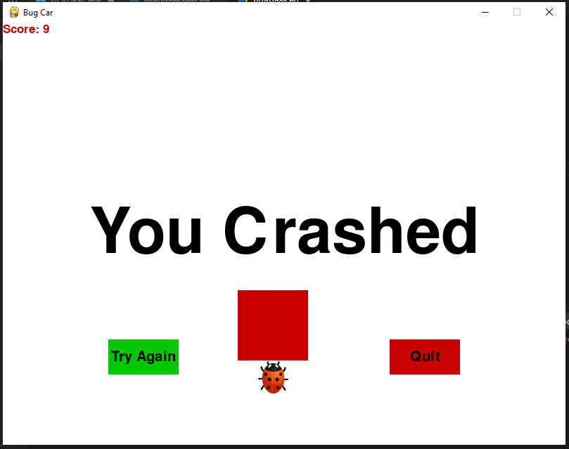

# **Race Bug Game**

**Race Bug** is a simple and fun arcade-style game built using **Pygame**, a popular Python library for creating games. In this game, you control a bug (the "Race Bug") and try to dodge incoming obstacles. The longer you survive, the higher your score! But be careful—crashing into an obstacle will end the game.

This game is perfect for beginners who want to explore game development with Python and Pygame. It’s lightweight, easy to understand, and a great way to get started with creating your own games!

---

## **Features**
- **Simple Controls**: Use the left and right arrow keys to move the bug.
- **Increasing Difficulty**: The game gets faster as you progress, making it more challenging.
- **Sound Effects**: Enjoy background music and a crash sound effect for an immersive experience.
- **Score Tracking**: Your score increases as you dodge more obstacles.

---

## **How to Play**
1. Run the game using Python (version 3.10 or higher).
2. Use the **left arrow key** to move the bug to the left and the **right arrow key** to move it to the right.
3. Dodge the red obstacles to increase your score.
4. If you crash into an obstacle, the game will end, and you can choose to try again or quit.

---

## **Requirements**
- Python 3.10 or higher
- Pygame 1.7 or higher

---

## **Installation**
1. Clone the repository:
   ```bash
   git clone https://github.com/MohammadHosseinYaghubi/BugRace
   ```
2. Navigate to the project directory:
   ```bash
   cd BugRace
   ```
3. Install the required dependencies:
   ```bash
   pip install pygame
   ```
4. Run the game:
   ```bash
   python main.py
   ```

---

## **Screenshots**
  
*Example screenshot of the game in action.*

---

## **Contributing**
If you'd like to contribute to this project, feel free to fork the repository and submit a pull request. Any improvements or new features are welcome!

---

## **License**
This project is licensed under the MIT License. See the [LICENSE](LICENSE.md) file for details.

---

## **About the Developer**
This game was developed by **Mohammad Hossein Yaghubi**.  
You can reach out via email at [m.h.yaghubi.info@gmail.com](mailto:m.h.yaghubi.info@gmail.com) or check out my [GitHub profile](https://github.com/MohammadHosseinYaghubi).

---

Enjoy playing **Race Bug**! 🚗💨

---
